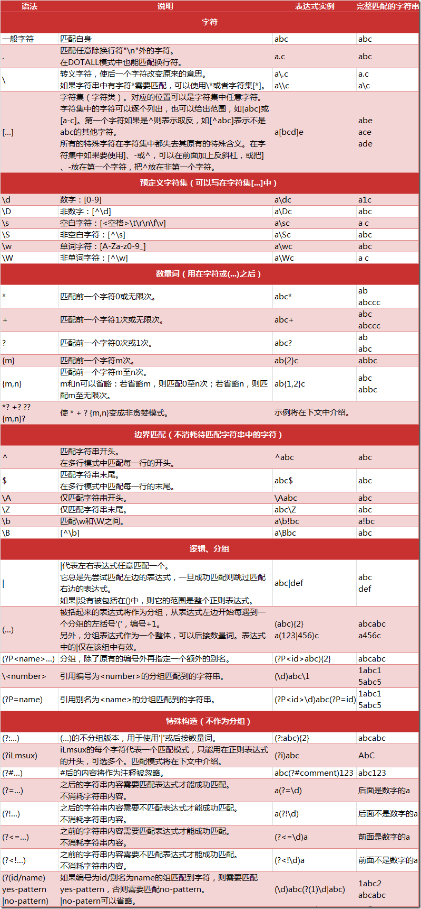

<!-- TOC depthFrom:1 depthTo:6 withLinks:1 updateOnSave:1 orderedList:0 -->

- [正则表达式](#正则表达式)
	- [正则表达式的常用操作符](#正则表达式的常用操作符)
	- [正则表达式语法实例](#正则表达式语法实例)
	- [经典正则表达式实例](#经典正则表达式实例)
	- [Re库](#re库)
		- [re.serch(pattern, string, flags=0)](#reserchpattern-string-flags0)
		- [re.match(pattern, string, flags=0)](#rematchpattern-string-flags0)
		- [re.findall(pattern, string, flags=0)](#refindallpattern-string-flags0)
		- [re.split(pattern, string, maxsplit=0, flags=0)](#resplitpattern-string-maxsplit0-flags0)
		- [re.finditer(pattern, string, flags=0)](#refinditerpattern-string-flags0)
		- [re.sub(pattern, repl, string, count=0, flags=0)](#resubpattern-repl-string-count0-flags0)
	- [Re库的另一种等价用法](#re库的另一种等价用法)
		- [regex = re.compile(pattern, flags=0)](#regex-recompilepattern-flags0)
	- [match对象](#match对象)
	- [Re库的贪婪匹配和最小匹配](#re库的贪婪匹配和最小匹配)
- [常用正则表达式](#常用正则表达式)

<!-- /TOC -->


# 正则表达式

##  正则表达式的常用操作符
|操作符|说明|实例|
|-|-|-|
|.|表示任何单个字符| |
|[ ]|字符集，对单个字符给出取值范围|[abc]表示a、b、c，[a-z]表示a到z单个字符|
|[^ ]|非字符集，对单个字符给出排除范围|[^abc]表示非a或b或c的单个字符|
|*|前一个字符0次或无限次扩展|abc*表示ab、abc、abcc、abccc等|
|+|前一个字符1次或无限次扩展|abc+表示abc、abcc、abccc等|
|?|前一个字符0次或1次扩展|abc？表示ab、abc|
|\||左右表达式任意一个|abc\|def表示abc、def|
|{m}|扩展前一个字符m次|ab{2}c表示abbc|
|{m,n}|扩展前一个字符m至n次（含n）|ab{1,2}c表示abc、abbc|
|^|匹配字符串开头|^abc表示abc且在一个字符串的开头|
|$|匹配字符串结尾|abc$表示abc且在一个字符串的结尾|
|( )|分组标记，内部只能使用\|操作符|(abc)表示abc，(av\|def)表示abc、def|
|\d|数字，等价与[0-9]| |
|\w|单词字符，等价于[A-Za-z0-9]| |


## 正则表达式语法实例
```
P(Y|YT|YTH|YTHO)?N  <--->  'PN'、'PYN'、'PYTN'、'PYTHN'、'PYTHON'
PYTHON+             <--->  'PYTHON'、'PYTHONN'、'PYTHONNN'、...
PY[TH]ON            <--->  'PYTON'、'PYHON'
PY[^TH]?ON          <--->  'PYON'、'PYaON'、'PYbON'、'PYcON'、...
PY{:3}N             <--->  'PN'、'PYN'、'PYYN'、'PYYYN'
```

## 经典正则表达式实例
```
^[A-Za-z]+$            <--->  由26个字母组成的字符串
^[A-Za-z0-9]+$         <--->  由26个字母和数字组成的字符串
^-?\d$                 <--->  整数数字形式的字符串
^[0-9]*[1-9][0-9]*$    <--->  正整数形式的字符串
[1-9]\d{5}             <--->  中国境内邮政编码，6位
[\u4e00-\u9fa5]        <--->  匹配中文字符
\d{3}-\d{8}|d{4}-\d{7} <--->  国内电话号码，010-68913536
\s+                    <--->  空格
```

## Re库

re库是python的标准库，主要用于字符串匹配
```
import re
```

+ re库采用raw string类型（原生字符串类型）表示正则表达式，表示为：r‘text’
  + `r‘[1-9]\d{5}’`
+ 原生字符串是不包含转义符的字符串

|函数|说明|
|-|-|
|re.search()|在任意位置开始往后查找，返回第一个符合规则的，只匹配一次。返回match对象|
|re.match()|在**起始**位置开始往后查找，返回第一个符合规则的，只匹配一次。返回match对象|
|re.findall()|所有的全部匹配，以列表类型返回全部能匹配的子串|
|re.split()|将一个字符串按照正则表达式匹配结果进行分割，返回列表类型|
|re.finditer()|搜索字符串，返回一个匹配结果的迭代类型，每个迭代元素是match对象|
|re.sub()|在一个字符串中替换素有匹配正则表达式的子串，返回替换后的字符串|


### re.search(pattern, string, flags=0)
+ 在一个字符串中搜索匹配正则表达式的第一个位置，返回match对象。
  + pattern：正则表达式的字符串或原生字符串表示
  + string：待匹配字符串
  + flags：正则表达式使用时的控制标记

     |常用标记|说明|
     |-|-|
     |re.I re.IGNORECASE|忽略正则表达式的大小写，[A-A]能够匹配小写字符|
     |re.M re.MULTILINE|正则表达式中的^操作符能够将给定字符串的每行当做匹配开始|
     |re.S re.DOTALL|正则表达式中的.操作符能够匹配所有字符，默认匹配除换行外的所有字符|

```python
>>> import re
>>> match = re.search(r'[1-9]\d{5}', 'BIT 100081')
>>> if match:
...     print(match.group(0))
...
100081
```

### re.match(pattern, string, flags=0)
 + 从一个字符串的开始位置起匹配正则表达式，返回match对象
  + pattern：正则表达式的字符串或原生字符串表示
  + string：待匹配字符串
  + flags：正则表达式使用时的控制标记

```python
>>> import re
>>> pattern = re.compile(r'\d+')
>>> m = pattern.match('abc123def456')
>>> m  # 从一个字符串的开始位置起匹配正则表达式，所以在abc123def456前面没有数字匹配

>>> m = pattern.match('abc123def456', 3, 5)
>>> type(m)
<class '_sre.SRE_Match'>
>>> print(m.group(0))
12  


>>> import re
>>> match = re.match(r'[1-9]\d{5}', 'BIT 100081')
>>> if match:
...     match.group(0)
...
>>> match.group(0)
Traceback (most recent call last):
  File "<stdin>", line 1, in <module>
AttributeError: 'NoneType' object has no attribute 'group'
>>> match = re.match(r'[1-9]\d{5}', '100081')
>>> if match:
...     print(match.group(0))
...
'100081'
>>>
```

### re.findall(pattern, string, flags=0)
+ 搜索字符串，以列表类型返回全部能匹配的子串
  + pattern：正则表达式的字符串或原生字符串表示
  + string：待匹配字符串
  + flags：正则表达式使用时的控制标记
```python
>>> import re
>>> ls = re.findall(r'[1-9]\d{5}', 'BIT100081 TSU100084')
>>> ls
['100081', '100084']
>>>
```

### re.split(pattern, string, maxsplit=0, flags=0)
+ 将一个字符串按照正则表达式匹配结果进行分割，返回列表类型
  + pattern：正则表达式的字符串或原生字符串表示
  + string：待匹配字符串
  + maxsplit：最大分割数，剩余部分最为最后一个元素输出
  + flags：正则表达式使用时的控制标记
```python
>>> import re
>>> re.split(r'[1-9]\d{5}', 'BIT100081 TSU100084')
['BIT', ' TSU', '']
>>> re.split(r'[1-9]\d{5}', 'BIT100081 TSU100084', maxsplit=1)
['BIT', ' TSU100084']
```

### re.finditer(pattern, string, flags=0)
+ 搜索字符串，返回一个匹配结果的迭代类型，每个迭代元素是match对象
  + pattern：正则表达式的字符串或原生字符串表示
  + string：待匹配字符串
  + flags：正则表达式使用时的控制标记
```python
>>> import re
>>> for m in re.finditer(r'[1-9]\d{5}', 'BIT100081 TSU100084'):
...     if m:
...             print(m.group(0))
...
100081
100084
```

### re.sub(pattern, repl, string, count=0, flags=0)
+  在一个字符串中替换素有匹配正则表达式的子串，返回替换后的字符串
  + pattern：正则表达式的字符串或原生字符串表示
  + repl：替换匹配字符串的字符串
  + string：待匹配字符串
  + count：匹配的最大提花次数
  + flags：正则表达式使用时的控制标记
```python
>>> import re
>>> re.sub(r'[1-9]\d{5}', ':zipcode', 'BIT100081 TSU100084')
'BIT:zipcode TSU:zipcode'
```

## Re库的另一种等价用法
面向对象用法：编译后的多次操作
```python
>>> import re
>>> pat = re.compile(r'[1-9]\d{5}')
>>> rst = pat.search('BIT 100081')
>>> rst.group(0)
'100081'
```

这种方式的好处是经过一次编译，当需要用到正则表达式匹配时，可以加快程序运行。
### regex = re.compile(pattern, flags=0)
+ 将正则表达式的字符串形式编译成正则表达式对象
  + pattern：正则表达式的字符串或原生字符串表示
  + flags：正则表达式使用时的控制标记

|函数|说明|
|-|-|
|regex.search()|在一个字符串中搜索匹配正则表达式的第一个位置，返回match对象|
|regex.match()|从一个字符串的开始位置起匹配正则表达式，返回match对象|
|regex.findall()|搜索字符串，以列表类型返回全部能匹配的子串|
|regex.split()|将一个字符串按照正则表达式匹配结果进行分割，返回列表类型|
|regex.finditer()|搜索字符串，返回一个匹配结果的迭代类型，每个迭代元素是match对象|
|regex.sub()|在一个字符串中替换素有匹配正则表达式的子串，返回替换后的字符串|

## macth对象
```python
>>> import re
>>> match = re.search(r'[1-9]\d{5}', 'BIT 100081')
>>> if match:
...     print(match.group(0))
...
100081
>>> type(match)
<class '_sre.SRE_Match'>
```

match对象的属性


|属性|说明|
|-|-|
|.string|待匹配的文本|
|.re|匹配时使用的pattern对象（正则表达式）|
|.pos|正则表达式搜索文本的开始位置|
|.endpos|正则表达式搜索文本的结束位置|


match对象的方法

|方法|说明|
|-|-|
|.group(0)|获得匹配后的字符串|
|.start()|匹配字符串在原始字符串的开始位置|
|.end()|匹配字符串在原始字符串的结束位置|
|.span()|返回(.start(), .end())|

```python
>>> import re
>>> m = re.search(r'[1-9]\d{5}', 'BIT 100081')
>>> m.string
'BIT 100081'
>>> m.re
re.compile('[1-9]\\d{5}')
>>> m.pos
0
>>> m.endpos
10
>>> m.group(0)  # 如果要返回每个结果，需要使用finditer
'100081'
>>> m.start()
4
>>> m.end()
10
>>> m.span()
(4, 10)
```

## Re库的贪婪匹配和最小匹配
+ 贪婪匹配实例
```python
>>> import re
>>> match = re.search(r'PY.*N', 'PYANBNCNDN')
>>> match.group(0)
'PYANBNCNDN'
```
Re库默认采用贪婪匹配，即输出匹配最长的子串

+ 贪婪匹配实例
```python
>>> match = re.search(r'PY.*?N', 'PYANBNCNDN')
>>> match.group(0)
'PYAN'
```

最小匹配操作符

|属性|说明|
|-|-|
|*?|前一个字符0次或无限次扩展，最小匹配|
|+?|前一个字符1次或无线次扩展，最小匹配|
|??|前一个字符0次或1次扩展，最小匹配|
|{m,n}?|扩展前一个字符m至n次（含n），最小匹配|


# 常用正则表达式
一、校验数字的表达式

1 数字：^[0-9]*$

2 n位的数字：^\d{n}$

3 至少n位的数字：^\d{n,}$

4 m-n位的数字：^\d{m,n}$

5 零和非零开头的数字：^(0|[1-9][0-9]*)$

6 非零开头的最多带两位小数的数字：^([1-9][0-9]*)+(.[0-9]{1,2})?$

7 带1-2位小数的正数或负数：^(\-)?\d+(\.\d{1,2})?$

8 正数、负数、和小数：^(\-|\+)?\d+(\.\d+)?$

9 有两位小数的正实数：^[0-9]+(.[0-9]{2})?$

10 有1~3位小数的正实数：^[0-9]+(.[0-9]{1,3})?$

11 非零的正整数：^[1-9]\d*$ 或 ^([1-9][0-9]*){1,3}$ 或 ^\+?[1-9][0-9]*$

12 非零的负整数：^\-[1-9][]0-9"*$ 或 ^-[1-9]\d*$

13 非负整数：^\d+$ 或 ^[1-9]\d*|0$

14 非正整数：^-[1-9]\d*|0$ 或 ^((-\d+)|(0+))$

15 非负浮点数：^\d+(\.\d+)?$ 或 ^[1-9]\d*\.\d*|0\.\d*[1-9]\d*|0?\.0+|0$

16 非正浮点数：^((-\d+(\.\d+)?)|(0+(\.0+)?))$ 或 ^(-([1-9]\d*\.\d*|0\.\d*[1-9]\d*))|0?\.0+|0$

17 正浮点数：^[1-9]\d*\.\d*|0\.\d*[1-9]\d*$ 或 ^(([0-9]+\.[0-9]*[1-9][0-9]*)|([0-9]*[1-9][0-9]*\.[0-9]+)|([0-9]*[1-9][0-9]*))$

18 负浮点数：^-([1-9]\d*\.\d*|0\.\d*[1-9]\d*)$ 或 ^(-(([0-9]+\.[0-9]*[1-9][0-9]*)|([0-9]*[1-9][0-9]*\.[0-9]+)|([0-9]*[1-9][0-9]*)))$

19 浮点数：^(-?\d+)(\.\d+)?$ 或 ^-?([1-9]\d*\.\d*|0\.\d*[1-9]\d*|0?\.0+|0)$

二、校验字符的表达式

1 汉字：^[\u4e00-\u9fa5]{0,}$

2 英文和数字：^[A-Za-z0-9]+$ 或 ^[A-Za-z0-9]{4,40}$

3 长度为3-20的所有字符：^.{3,20}$

4 由26个英文字母组成的字符串：^[A-Za-z]+$

5 由26个大写英文字母组成的字符串：^[A-Z]+$

6 由26个小写英文字母组成的字符串：^[a-z]+$

7 由数字和26个英文字母组成的字符串：^[A-Za-z0-9]+$

8 由数字、26个英文字母或者下划线组成的字符串：^\w+$ 或 ^\w{3,20}$

9 中文、英文、数字包括下划线：^[\u4E00-\u9FA5A-Za-z0-9_]+$

10 中文、英文、数字但不包括下划线等符号：^[\u4E00-\u9FA5A-Za-z0-9]+$ 或 ^[\u4E00-\u9FA5A-Za-z0-9]{2,20}$

11 可以输入含有^%&',;=?$\"等字符：[^%&',;=?$\x22]+

12 禁止输入含有~的字符：[^~\x22]+

三、特殊需求表达式

1 Email地址：^\w+([-+.]\w+)*@\w+([-.]\w+)*\.\w+([-.]\w+)*$

2 域名：[a-zA-Z0-9][-a-zA-Z0-9]{0,62}(/.[a-zA-Z0-9][-a-zA-Z0-9]{0,62})+/.?

3 InternetURL：[a-zA-z]+://[^\s]* 或 ^http://([\w-]+\.)+[\w-]+(/[\w-./?%&=]*)?$

4 手机号码：^(13[0-9]|14[5|7]|15[0|1|2|3|5|6|7|8|9]|18[0|1|2|3|5|6|7|8|9])\d{8}$

5 电话号码("XXX-XXXXXXX"、"XXXX-XXXXXXXX"、"XXX-XXXXXXX"、"XXX-XXXXXXXX"、"XXXXXXX"和"XXXXXXXX)：^(\(\d{3,4}-)|\d{3.4}-)?\d{7,8}$

6 国内电话号码(0511-4405222、021-87888822)：\d{3}-\d{8}|\d{4}-\d{7}

7 身份证号(15位、18位数字)：^\d{15}|\d{18}$

8 短身份证号码(数字、字母x结尾)：^([0-9]){7,18}(x|X)?$ 或 ^\d{8,18}|[0-9x]{8,18}|[0-9X]{8,18}?$

9 帐号是否合法(字母开头，允许5-16字节，允许字母数字下划线)：^[a-zA-Z][a-zA-Z0-9_]{4,15}$

10 密码(以字母开头，长度在6~18之间，只能包含字母、数字和下划线)：^[a-zA-Z]\w{5,17}$

11 强密码(必须包含大小写字母和数字的组合，不能使用特殊字符，长度在8-10之间)：^(?=.*\d)(?=.*[a-z])(?=.*[A-Z]).{8,10}$

12 日期格式：^\d{4}-\d{1,2}-\d{1,2}

13 一年的12个月(01～09和1～12)：^(0?[1-9]|1[0-2])$

14 一个月的31天(01～09和1～31)：^((0?[1-9])|((1|2)[0-9])|30|31)$

15 钱的输入格式：

16 1.有四种钱的表示形式我们可以接受:"10000.00" 和 "10,000.00", 和没有 "分" 的 "10000" 和 "10,000"：^[1-9][0-9]*$

17 2.这表示任意一个不以0开头的数字,但是,这也意味着一个字符"0"不通过,所以我们采用下面的形式：^(0|[1-9][0-9]*)$

18 3.一个0或者一个不以0开头的数字.我们还可以允许开头有一个负号：^(0|-?[1-9][0-9]*)$

19 4.这表示一个0或者一个可能为负的开头不为0的数字.让用户以0开头好了.把负号的也去掉,因为钱总不能是负的吧.下面我们要加的是说明可能的小数部分：^[0-9]+(.[0-9]+)?$

20 5.必须说明的是,小数点后面至少应该有1位数,所以"10."是不通过的,但是 "10" 和 "10.2" 是通过的：^[0-9]+(.[0-9]{2})?$

21 6.这样我们规定小数点后面必须有两位,如果你认为太苛刻了,可以这样：^[0-9]+(.[0-9]{1,2})?$

22 7.这样就允许用户只写一位小数.下面我们该考虑数字中的逗号了,我们可以这样：^[0-9]{1,3}(,[0-9]{3})*(.[0-9]{1,2})?$

23 8.1到3个数字,后面跟着任意个 逗号+3个数字,逗号成为可选,而不是必须：^([0-9]+|[0-9]{1,3}(,[0-9]{3})*)(.[0-9]{1,2})?$

24 备注：这就是最终结果了,别忘了"+"可以用"*"替代如果你觉得空字符串也可以接受的话(奇怪,为什么?)最后,别忘了在用函数时去掉去掉那个反斜杠,一般的错误都在这里

25 xml文件：^([a-zA-Z]+-?)+[a-zA-Z0-9]+\\.[x|X][m|M][l|L]$

26 中文字符的正则表达式：[\u4e00-\u9fa5]

27 双字节字符：[^\x00-\xff] (包括汉字在内，可以用来计算字符串的长度(一个双字节字符长度计2，ASCII字符计1))

28 空白行的正则表达式：\n\s*\r (可以用来删除空白行)

29 HTML标记的正则表达式：<(\S*?)[^>]*>.*?</\1>|<.*? /> (网上流传的版本太糟糕，上面这个也仅仅能部分，对于复杂的嵌套标记依旧无能为力)

30 首尾空白字符的正则表达式：^\s*|\s*$或(^\s*)|(\s*$) (可以用来删除行首行尾的空白字符(包括空格、制表符、换页符等等)，非常有用的表达式)

31 腾讯QQ号：[1-9][0-9]{4,} (腾讯QQ号从10000开始)

32 中国邮政编码：[1-9]\d{5}(?!\d) (中国邮政编码为6位数字)

33 IP地址：\d+\.\d+\.\d+\.\d+ (提取IP地址时有用)

34 IP地址：((?:(?:25[0-5]|2[0-4]\\d|[01]?\\d?\\d)\\.){3}(?:25[0-5]|2[0-4]\\d|[01]?\\d?\\d))
